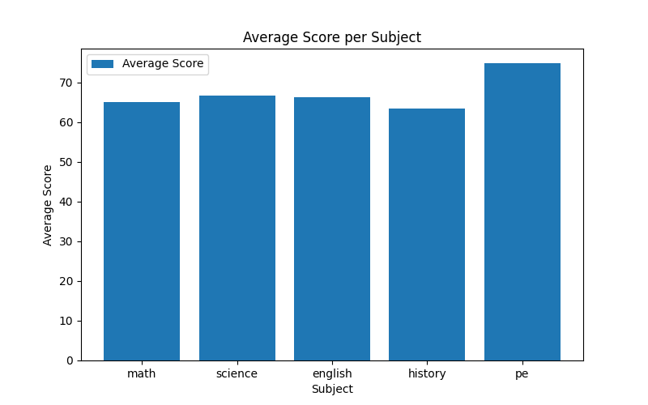
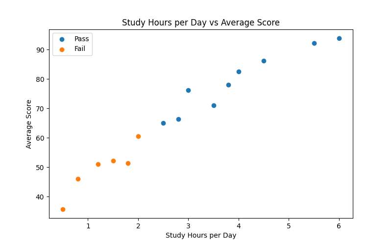
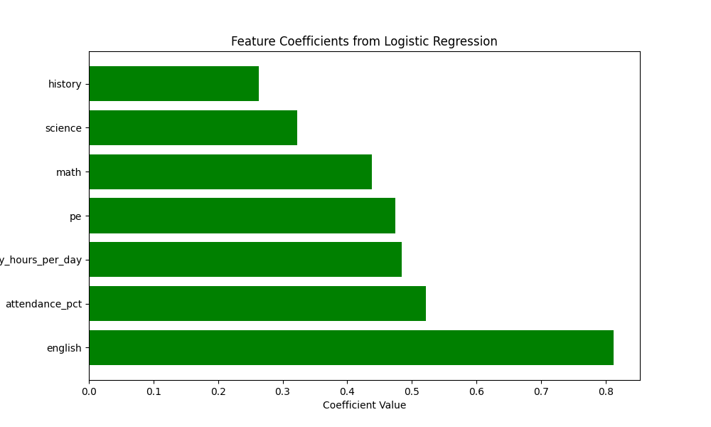

# Student Performance Analysis and Prediction

## Objective
This is a simple Python project I built to learn and experiment with student data analysis, basic machine learning models, and common scikit-learn techniques.

The project is done in a Jupyter Notebook and focuses on:
- exploring student performance data
- visualizing patterns using graphs
- building a basic machine learning model to predict whether a student will pass or fail

The main purpose of this project is learning by doing and understanding how a complete beginner-level machine learning workflow works from start to finish.

---

## Dataset Information
The project uses a dataset file named `students.csv`. It contains the following columns:

- `name`: name of the student
- `math`: math score
- `science`: science score
- `english`: english score
- `history`: history score
- `pe`: physical education score
- `attendance_pct`: attendance percentage
- `study_hours_per_day`: average number of hours the student studies per day
- `passed`: target column indicating the final result  
  - `1` = Pass  
  - `0` = Fail  

---

## Tools Used
- Python
- Jupyter Notebook
- pandas
- matplotlib
- seaborn
- scikit-learn

---

## Project Workflow

### 1. Data Exploration with pandas
In the first part of the notebook, I explored the dataset to understand its structure and values.

This includes:
- printing the first 5 rows
- checking the dataset shape
- checking data types of each column
- printing summary statistics
- counting how many students passed and failed
- comparing average subject scores for pass and fail students
- finding the student with the highest overall average score

### 2. Data Visualization with matplotlib
I created different Matplotlib plots to better understand the data:

- bar chart of average score per subject
- histogram of math scores
- scatter plot of study hours vs average score
- box plot of attendance for pass and fail students
- line plot of math and science scores for all students

### 3. Data Visualization with seaborn
I also used Seaborn for grouped and statistical plots:

- bar plots of average math and science scores by pass/fail
- scatter plot of attendance percentage vs average score
- regression lines for pass and fail groups

### 4. Machine Learning with scikit-learn
In the final part of the project, I used Logistic Regression to predict whether a student will pass or fail.

The model uses:
- math
- science
- english
- history
- pe
- attendance percentage
- study hours per day

The target column is:
- `passed`

The workflow includes:
- train/test split
- feature scaling using `StandardScaler`
- model training
- model evaluation
- feature coefficient analysis
- prediction for a new student

---

## Key Insights
From the visualizations and model results, a few patterns become easier to notice:

- students with better attendance and more study hours generally perform better
- passing students usually have higher average subject scores than failing students
- the model coefficients help show which features had a stronger effect on the final prediction

---

## Example Plots

### Average Score Per Subject


### Study Hours vs Average Score


### Feature Importance


---

## How the Prediction Works
The machine learning process in this project follows a simple workflow.

First, the data is divided into:
- features (input values such as scores, attendance, and study hours)
- target (the final pass/fail result)

Then the data is split into training and testing sets. The model learns patterns from the training data and is later checked on the test data.

Before training, feature scaling is applied using `StandardScaler`. This is useful because different columns have different value ranges. For example, subject scores are much larger in value than study hours, so scaling helps the model handle them more fairly.

After that, a Logistic Regression model is trained. For a new student, the model calculates:
- probability of fail
- probability of pass

Whichever probability is higher becomes the final prediction.

For example:
- if probability of fail = 0.09
- and probability of pass = 0.91

then the final prediction becomes **Pass**.

Since this project uses a very small dataset, the model accuracy may vary. The main goal here is to understand the full workflow and experiment with basic ML techniques rather than focus only on accuracy.

---

## Project Structure
```text
student-performance-analysis/
├── .gitignore
├── README.md
├── part4_visualization_ml.ipynb
├── plot1_bar.png
├── plot2_histogram.png
├── plot3_scatter.png
├── plot4_boxplot.png
├── plot5_line.png
├── plot6_seaborn_bar.png
├── plot7_seaborn_scatter.png
├── plot8_feature_importance.png
├── requirements.txt
└── students.csv
```

## Setup Instructions

To run this project on your local machine, follow these steps in your terminal:

Create a virtual environment:
```text
python -m venv .venv
```

Activate the virtual environment:

For Git Bash on Windows:
```text
source .venv/Scripts/activate
```

For PowerShell on Windows:
```text
.\.venv\Scripts\activate.ps1
```

For Mac/Linux:
```text
source .venv/bin/activate
```

Install the required packages:
```text
pip install -r requirements.txt
```

Start Jupyter Notebook:
```text
jupyter notebook
```

---

## Notes
* Open the notebook file to see the full code, outputs, and visualizations.
* All generated plots are saved in the root folder of the project.
* This project is based on a small dataset, so the machine learning results are mainly for learning and experimentation.
Possible Improvements

---
## Possible Improvments
In the future, I plan to extend this project further by:

* using a larger dataset
* experimenting with more machine learning models and techniques
* comparing the performance of different models
* improving the analysis and interpretation of results
* building a proper frontend so users can visualize the data and interact with predictions more easily

I want to use this project as a starting point and gradually develop it into a larger and more practical project.